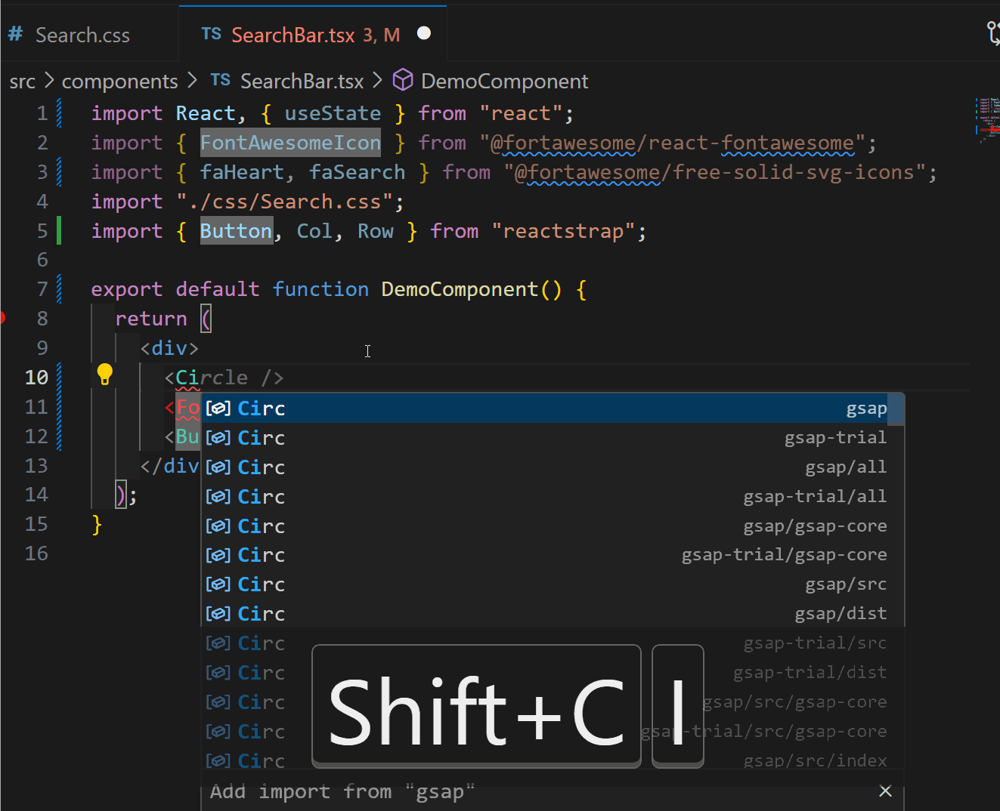

# React Import Highlighter




This extension is tailored for React developers. It provides features and tools to streamline your React development workflow.

## Features

- Automatic detection of React components and libraries in your project.
- Improved code navigation within your React project.

## Requirements

To use this extension, you need:

- Visual Studio Code (latest version recommended).
- A React project or React-related files.

## Extension Settings

This extension contributes the following settings:

- `reactImportHighlighter.packageJsonPath`: Path to your `package.json` file relative to the workspace root. For example, if your `package.json` is in the root directory of your workspace, you can set this to `"./package.json"`.

- `reactImportHighlighter.highlightColor`: Customize the highlight color for dependencies. The value should be in RGBA format, for example: `"rgba(255,0,0,.35)"`. This setting allows you to change the

You can configure these settings in your Visual Studio Code settings.

## Where to Add These Settings

Inside the `settings.json` file in the `.vscode` folder, you can override default and user settings by adding:

```json
{
  "reactImportHighlighter.packageJsonPath": "./package.json",
  "reactImportHighlighter.highlightColor": "rgba(255,0,0,.35)"
}
```

## Release Notes

Stay updated with the latest changes and improvements in React Import Highlighter.

### 1.0.0

- Initial release of React Import Highlighter, focused on React development.

## Known Issues

Below are the known issues as of the current version:

## Unintended Extended Highlighting on Import Names

- **Description**: : When additional characters are typed immediately after a highlighted import item, the highlighting extends to include those additional characters.
- **Impact**: Causes misleading highlights in the editor.
- **Workaround**: Save the file (Ctrl+S) to reset the highlighting to its intended scope.

**Enjoy React development with React Import Highlighter!**
